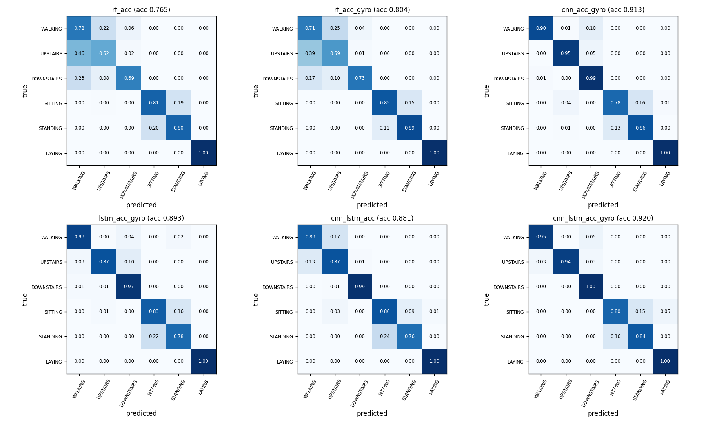
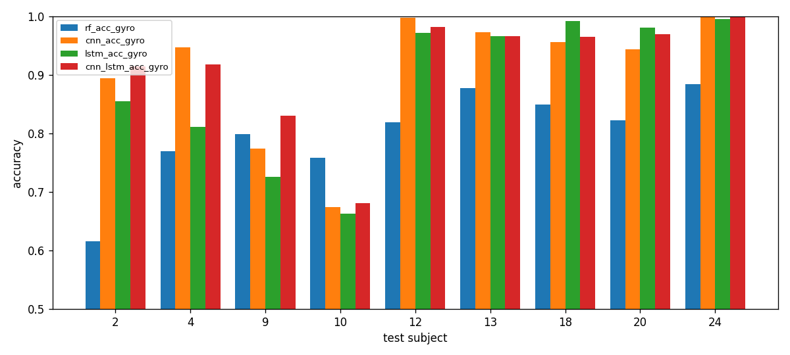

## 7. Error Analysis

This section looks at *where* the models fail, using the test predictions of the six reported runs (seed 42) on the 2,947 test windows from 9 unseen subjects. All numbers come from `src/evaluate.py` (output in `results/analysis/error_analysis.json`, figures `confusion_matrices.png` and `per_subject_accuracy.png`). The Random Forest saves no predictions, so `evaluate.py` re-fits it with the same settings (300 trees, seed 42) and checks that its accuracy matches `results/rf_*.json`. Nothing here was used to tune a model.

### 7.1 Which classes are hard

**Table E1.** Per-class F1 (test set). Higher is better.

| Class | RF Acc | RF Acc+Gyro | CNN Acc+Gyro | LSTM Acc+Gyro | CNN-LSTM Acc | CNN-LSTM Acc+Gyro |
|---|---:|---:|---:|---:|---:|---:|
| WALKING | 0.615 | 0.638 | 0.942 | 0.941 | 0.849 | 0.958 |
| UPSTAIRS | 0.569 | 0.609 | 0.947 | 0.912 | 0.828 | 0.968 |
| DOWNSTAIRS | 0.773 | 0.818 | 0.917 | 0.909 | 0.991 | 0.956 |
| SITTING | 0.800 | 0.865 | 0.816 | 0.802 | 0.810 | 0.812 |
| STANDING | 0.813 | 0.881 | 0.857 | 0.799 | 0.822 | 0.850 |
| LAYING | 1.000 | 1.000 | 0.995 | 1.000 | 0.994 | 0.979 |

The table shows three patterns.

1. **SITTING and STANDING are the weak spot of every deep model.** For the main model (CNN-LSTM, Acc+Gyro) the two largest error types are STANDING predicted as SITTING (83 windows, 15.6% of all STANDING windows) and SITTING predicted as STANDING (75 windows, 15.3%). The CNN and LSTM make the same mistake (for the LSTM, 21.6% of STANDING windows go to SITTING). Both postures are nearly motionless, so a 2.56 s window of a seated and a standing person look alike, and the only clear difference is a small change in the gravity direction. The gyroscope does not help here: the CNN-LSTM's SITTING F1 is 0.810 with Acc and 0.812 with Acc+Gyro. We think the confusion is a limit of what a waist-worn sensor can see, but we did not test this directly.
2. **The walking family (WALKING, UPSTAIRS, DOWNSTAIRS) is where the gyroscope and the model type matter.** With Acc only, the CNN-LSTM sends 17.3% of WALKING windows to UPSTAIRS (86 windows) and 12.5% of UPSTAIRS windows to WALKING (59). Adding the gyroscope raises WALKING F1 from 0.849 to 0.958 and UPSTAIRS from 0.828 to 0.968, which is most of the 3.9-point accuracy gain reported in Section 5. The static classes barely change. A plausible reason is that rotation of the body during a stride separates the three gaits better than acceleration alone, while posture is already encoded by gravity in the accelerometer. DOWNSTAIRS is an exception: it scores 0.991 with Acc and 0.956 with Acc+Gyro, so the gyroscope does not help every class.
3. **LAYING is almost never missed**, because lying changes the gravity direction on a different axis than the other postures. The only visible leak for the main model is 23 SITTING windows predicted as LAYING (4.7%).

The Random Forest fails in a different place. Its F1 for WALKING and UPSTAIRS is only 0.61-0.64, because 39% of UPSTAIRS windows (185) are predicted as WALKING. Its five hand-crafted statistics per axis (mean, std, min, max, energy) summarise a window but discard the shape and timing of the signal, which is what separates the three gaits. For the static classes it is actually better than the deep models (SITTING 0.865 and STANDING 0.881 with Acc+Gyro, against 0.812 and 0.850 for the CNN-LSTM). This is consistent with static posture depending mainly on the mean gravity direction, which simple per-axis statistics capture well.

### 7.2 Do the models fail on the same windows?

For the three Acc+Gyro deep models, 386 of the 2,947 test windows (13.1%) are wrong for at least one model, and 173 (5.9%) are wrong for all three. Of those 173 shared errors, 76 are SITTING windows and 67 are STANDING windows (83% together), 19 are UPSTAIRS and 11 are WALKING. No DOWNSTAIRS or LAYING window is missed by all three. The shared errors are therefore mostly the SITTING/STANDING ambiguity from 7.1, which suggests a limit of the data rather than a weakness of one architecture. The remaining 213 windows are missed by only one or two models, and this is where the architectures differ.

### 7.3 Do the models fail on the same people?

**Table E2.** Test accuracy per test subject (Acc+Gyro).

| Subject | RF | CNN | LSTM | CNN-LSTM |
|---|---:|---:|---:|---:|
| 2 | 0.616 | 0.894 | 0.854 | 0.914 |
| 4 | 0.770 | 0.946 | 0.811 | 0.918 |
| 9 | 0.799 | 0.774 | 0.726 | 0.830 |
| 10 | 0.759 | 0.674 | 0.663 | 0.680 |
| 12 | 0.819 | 0.997 | 0.972 | 0.981 |
| 13 | 0.878 | 0.973 | 0.966 | 0.966 |
| 18 | 0.849 | 0.956 | 0.992 | 0.964 |
| 20 | 0.822 | 0.944 | 0.980 | 0.969 |
| 24 | 0.885 | 1.000 | 0.995 | 1.000 |

The headline accuracy hides a large spread between people. Subjects 12, 13, 18, 20 and 24 are classified at 94-100% by all three deep models, while subject 10 stays at 66-68% for every deep model and subject 9 at 73-83%. These two subjects are low for all three architectures, so the cause possibly lies in how those people move or wear the phone rather than in one model (we did not test this). The Random Forest has a different profile (it is worst on subject 2, at 0.616), which shows that its errors are of another kind. Because the test set has only 9 subjects, two difficult subjects pull the average down by several points, and the gap between the three deep models (0.89-0.92 overall) is smaller than the gap between subjects. A model comparison on 9 subjects therefore has to be read with care. The leave-one-subject-out experiment in Section 6.5 confirms this on all 30 subjects: accuracy ranges from 66% to 100%, and subject 10 is again the hardest.

### 7.4 What this means

- The main remaining error is SITTING versus STANDING, shared by all deep models and not fixed by the gyroscope; it may need a different signal or context rather than a different architecture, but we did not test this.
- The gyroscope mainly helps the walking family, and the CNN-LSTM benefits most from it there.
- The Random Forest's weakness is the walking family, a consequence of the hand-crafted features.
- Which subject is in the test set changes accuracy more than which deep model is used.

### 7.5 Limitations

The explanations in 7.1 (why SITTING/STANDING look alike, why the gyroscope helps gaits) are plausible readings of the confusion matrices, not tested claims. We did not inspect the raw signals of the misclassified windows or check which sensor placement or subject properties explain subjects 9 and 10. Each model was run once with seed 42, so differences of a few tenths of a point between models (for example CNN 0.913 versus CNN-LSTM 0.920) are within the seed-to-seed variation of almost one point measured in Section 6.2.
