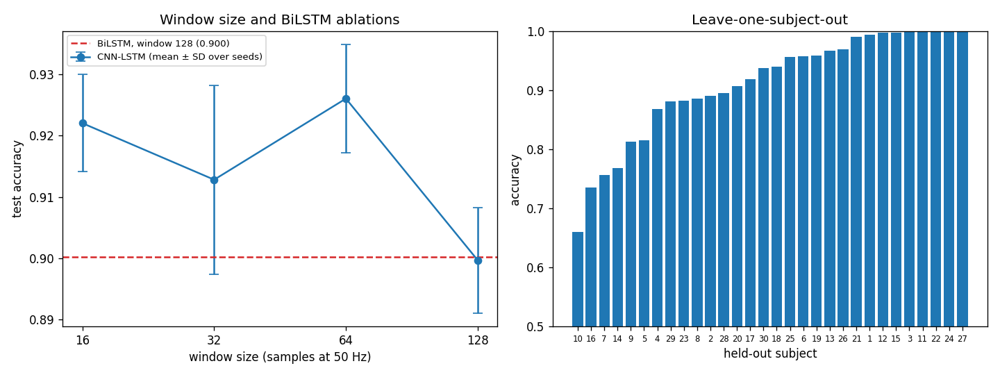

## 6. Results Discussion and Ablations

This section brings the six reported runs together, asks how much a single seed-42 run can be trusted, and then reports three ablations on the main model: window length, a bidirectional LSTM, and leave-one-subject-out evaluation. The ablations follow the shared protocol (Adam 1e-3, batch 64, at most 30 epochs, early stopping on validation macro-F1 with patience 6) and never use the test set to choose anything. They were all run on machine D, the same machine as the reported CNN-LSTM results. Code: `scripts/analysis_*.py`; outputs: `results/analysis/`.

### 6.1 The six reported runs

**Table D1.** Test results of the six runs (seed 42, official test split).

| Model | Input | Accuracy (%) | Macro-F1 (%) |
|---|---|---:|---:|
| Random Forest | Acc | 76.48 | 76.15 |
| Random Forest | Acc+Gyro | 80.39 | 80.16 |
| 1D-CNN | Acc+Gyro | 91.31 | 91.25 |
| LSTM | Acc+Gyro | 89.35 | 89.36 |
| CNN-LSTM | Acc | 88.09 | 88.23 |
| CNN-LSTM | Acc+Gyro | 91.99 | 92.05 |

Three things stand out.

**The gyroscope helps both model families by the same amount.** Adding the three gyroscope channels raises the Random Forest from 76.48% to 80.39% and the CNN-LSTM from 88.09% to 91.99%. Both gains are 3.9 points. A model that learns its own features from the raw signal and one that relies on five hand-made statistics per axis benefit equally, which suggests that the gain comes from information in the signal itself, not from one architecture being able to use it better. The error analysis (Section 7) shows where it comes from: almost all of it is in the three walking classes.

**Learning features from the raw signal matters more than anything else.** On the same input, every deep model beats the Random Forest by 9 to 12 points. This is the largest effect in the project, larger than the sensor choice and much larger than the differences between the deep architectures.

**Among the deep models, the CNN and the CNN-LSTM are level and the LSTM trails.** The CNN-LSTM is 0.7 points ahead of the CNN, but as 6.2 shows, that is smaller than the spread between seeds and is also measured across two machines. The LSTM is 2-2.6 points behind both. A plausible reading is that the convolutional front end, which both of the stronger models share, is what does most of the work on these short windows.

### 6.2 How far can one seed-42 run be trusted?

All headline numbers come from a single run. To see how much that matters, we trained the unchanged CNN-LSTM (Acc+Gyro, window 128) with four seeds on machine D through the analysis scripts.

**Table D2.** The same model and protocol, four seeds, machine D.

| Seed | 42 | 0 | 1 | 2 | Mean ± SD |
|---|---:|---:|---:|---:|---:|
| Accuracy (%) | 88.80 | 90.36 | 89.92 | 90.80 | 89.97 ± 0.86 |
| Epochs run | 8 | 12 | 9 | 9 | |

Seed 42 gives 88.80% here, not the reported 91.99%, even though the protocol is the same. The reason is mundane: `train_main_model.py` builds the model once to print its summary and then builds it again for training, so its weights are drawn from a later point in the random stream than in the analysis scripts. "Seed 42" therefore does not pick one fixed initialisation; it depends on the code around it.

Two conclusions follow. First, the reported 91.99% sits at the upper end of what this model usually reaches; over these four seeds it averages about 90.0%. Second, a standard deviation of almost one point means that differences below about one point between single runs cannot be read as one model being better. This applies directly to the 0.7-point gap between the CNN-LSTM and the CNN. The 3.9-point gyroscope gain, on the other hand, is several standard deviations wide and survives this check.

The runs also stop early: 8 to 12 epochs, which means the selected checkpoint is from epoch 2 to 6. Validation contains only four subjects, so its macro-F1 jumps from epoch to epoch, and early stopping tends to lock in whichever epoch happened to peak. We think this is the main source of the seed-to-seed spread.

### 6.3 Ablation 1: window length

The dataset comes as fixed 128-sample windows (2.56 s), so we cannot test longer windows without re-segmenting the raw recordings. We can test shorter ones. Each window is cut into non-overlapping pieces of 16, 32 or 64 samples, the model is trained on the pieces, and at test time the softmax outputs of the pieces belonging to one window are averaged. Every setting is therefore scored on the same 2,947 test windows. Each size was run with four seeds (42, 0, 1, 2).

**Table D3.** CNN-LSTM, Acc+Gyro, mean ± SD over four seeds.

| Window (samples) | Duration | Pieces per window | Accuracy (%) | Macro-F1 (%) | Mean epochs | Mean train time (s) |
|---:|---:|---:|---:|---:|---:|---:|
| 16 | 0.32 s | 8 | 92.20 ± 0.79 | 92.20 ± 0.75 | 9.0 | 134 |
| 32 | 0.64 s | 4 | 91.28 ± 1.54 | 91.28 ± 1.60 | 12.2 | 121 |
| 64 | 1.28 s | 2 | 92.60 ± 0.88 | 92.62 ± 0.90 | 16.0 | 117 |
| 128 | 2.56 s | 1 | 89.97 ± 0.86 | 89.96 ± 0.84 | 9.5 | 58 |

Shorter pieces do better than the full window: 64 samples reaches 92.6% on average, 2.6 points above the 128-sample setting, and even 16 samples (a third of a second) reaches 92.2%. The trend is not smooth, since 32 samples falls between the two with the largest spread, so we would not claim that one particular length is best.

This should not be read as "shorter windows contain more information". Two other things change along with the window length:

- **More training examples.** Cutting each window into pieces multiplies the number of training examples (by 8 at length 16) and the number of gradient updates per epoch. The model gets more, if shorter, examples to learn from.
- **Averaging at test time.** A 128-sample window is classified once, whereas a window cut into eight pieces is classified eight times and the votes are averaged. That is a small ensemble, and ensembles are usually more accurate and more stable.

What the experiment does show is that the full 2.56 s of context is not needed: a CNN-LSTM that only sees 0.3-1.3 s at a time, and then pools its decisions over the window, does at least as well. Splitting the two effects apart would need a further run, for example training on pieces but testing on single pieces without averaging.

### 6.4 Ablation 2: bidirectional LSTM

The only change here is `bidirectional=True` in the LSTM. The classifier reads the final hidden state of both directions (taking the last output step would give the backward direction only one step of context). Both variants were trained with the same four seeds.

**Table D4.** Unidirectional versus bidirectional LSTM back end (Acc+Gyro, window 128, four seeds).

| Back end | Parameters | Accuracy (%) | Macro-F1 (%) | Mean epochs | Mean train time (s) |
|---|---:|---:|---:|---:|---:|
| LSTM (main model) | 308,422 | 89.97 ± 0.86 | 89.96 ± 0.84 | 9.5 | 58 |
| BiLSTM | 704,454 | 90.02 ± 2.28 | 89.97 ± 2.35 | 12.0 | 141 |

Reading the window in both directions brings nothing: the mean accuracy is the same to within a twentieth of a point, while the model has 2.3 times as many parameters and takes about 2.4 times as long to train. It is also much less stable. Its four runs range from 87.58% to 92.77%, against 88.80% to 90.80% for the unidirectional model. With a classifier that already sees the whole window before it decides, the backward pass seems to add capacity that the small training set cannot use. The unidirectional design is the better choice.

### 6.5 Ablation 3: leave-one-subject-out

The official split tests on only 9 people. To see how the main model generalises across all 30, we pooled every subject and trained 30 models, each time holding out one subject as the test set. For each fold, four of the remaining 29 subjects (drawn with seed 42) served as the validation set for early stopping, so the held-out person never influenced model selection.

**Table D5.** CNN-LSTM, Acc+Gyro, 30 folds, seed 42.

| Measure | Value |
|---|---:|
| Mean accuracy per subject | 91.12% |
| Standard deviation across subjects | 9.18 points |
| Worst subject (10) | 65.99% |
| Best subjects (3, 11, 22, 24, 27) | 100.00% |
| Subjects below 85% | 6 of 30 (10, 16, 7, 14, 9, 5) |
| Pooled accuracy over all 10,299 windows | 91.49% |
| Pooled macro-F1 | 91.68% |

The average across all 30 subjects, 91.1%, is close to the official test result (91.99%, or about 90% averaged over seeds), so the official split does not give a misleading picture of the typical case. What the average hides is the spread. For most people the model is very good: 18 of the 30 subjects are above 90%, and five are classified perfectly. For a few it is poor, and subject 10 in particular stays around 66%, the same level it reaches in the official split (68%). The six weakest subjects drag the mean down, and a user like subject 10 would find the system unreliable.

The kind of mistake does not change. Over all 30 folds the two largest errors are STANDING predicted as SITTING (365 windows, 19.2% of STANDING) and SITTING predicted as STANDING (258 windows, 14.5%), exactly the pair that dominates on the official test set. More training subjects do not remove this confusion.

Two caveats apply. Each fold is a single seed-42 run, so the score of an individual subject is subject to the seed noise from 6.2. And the z-score statistics were fitted once on the official training subjects and reused in every fold, so in folds that hold out one of those 21 subjects, the normalisation has seen that subject's data. The effect on a mean and a standard deviation per channel is small, but it is a slight leak.

### 6.6 What we take from this

- **On the research question:** adding the gyroscope improves recognition by about 3.9 points, for both the Random Forest and the CNN-LSTM, and this gain is well above run-to-run noise. Nearly all of it comes from separating the three walking activities.
- **On the models:** learning from the raw signal is worth about 10 points over hand-crafted features. Among the deep models, the CNN and the CNN-LSTM cannot be separated with one run each; the LSTM alone is clearly weaker.
- **On the main model's design:** a bidirectional LSTM adds cost and instability but no accuracy. Shorter windows with averaged predictions do better than one pass over the full window, though part of that gain is an ensemble effect.
- **On evaluation:** the person being tested matters more than the choice between the CNN and the CNN-LSTM. Across 30 subjects, accuracy ranges from 66% to 100%, and a single seed can move the main result by about a point.

### 6.7 Limitations

- Every model in Table D1 is a single run, and the four-seed check in 6.2 covers only the CNN-LSTM. The CNN and LSTM may have a similar spread, but we did not measure it.
- The ablations were run on machine D. Their absolute values can be compared with each other and with the reported CNN-LSTM, but comparisons with the CNN and LSTM (machine B) carry the cross-machine uncertainty noted in Section 5.
- The window ablation cannot go beyond 128 samples, and it mixes window length with the number of training examples and test-time averaging (6.3).
- LOSO uses one seed per fold and the global normalisation described in 6.5.
- We did not try to explain why subjects 10, 16 and 7 are hard, for example by looking at their raw signals or at how they performed each activity.
